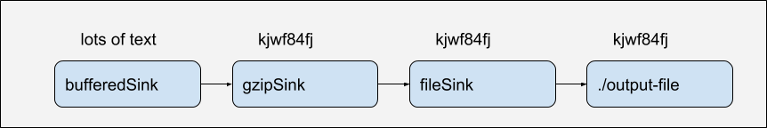

# HTTP Clients
### A survey of URLConnection, Okhttp, and more
#### Quincy Bowers
#### AppDetex

### Abstract
You're using HTTP every day and there are lots of tools available to help you out.
<!-- .element: style="font-size: 0.75em" -->

But do you understand how these tools differ and why you would choose one over the other?
<!-- .element: style="font-size: 0.75em" -->

HTTP is not all that complicated and in this talk I'll prove it by showing you how to implement
a simple Web application using a few different HTTP clients.
<!-- .element: style="font-size: 0.75em" -->

We'll discuss how each of the tools differ so you can make informed decisions in the future.
<!-- .element: style="font-size: 0.75em" -->

## Agenda
* A brief history of HTTP
<!-- .element: style="font-size: 0.75em" -->
* Making a request with Telnet
<!-- .element: style="font-size: 0.75em" -->
* JVM HTTP Clients
<!-- .element: style="font-size: 0.75em" -->
    * java.net.URLConnection
<!-- .element: style="font-size: 0.75em" -->
    * Apache
<!-- .element: style="font-size: 0.75em" -->
    * OkHttp
<!-- .element: style="font-size: 0.75em" -->
* Some Ok Libraries
<!-- .element: style="font-size: 0.75em" -->
    * Okio
<!-- .element: style="font-size: 0.75em" -->
    * Moshi
<!-- .element: style="font-size: 0.75em" -->
    * Retrofit
<!-- .element: style="font-size: 0.75em" -->
* Unit Testing HTTP Interactions
<!-- .element: style="font-size: 0.75em" -->

### History
* May 1996 (v 1.0)
    * RFC 1945
* June 1999 (v 1.1)
    * RFC 2616
* June 2014 (v 1.1)
    * RFC 7230, RFC 7231, RFC 7232
    * RFC 7233, RFC 7234, RFC 7235
* May 2015 (v 2)
    * RFC-7540

### HTTP Request Methods
* GET
* HEAD
* POST
* PUT
* DELETE
* CONNECT
* TRACE
* PATCH

# Ready to make some requests?

# Telnet
    $ telnet localhost 8080
    Trying 127.0.0.1...
    Connected to localhost.
    Escape character is '^]'.
    GET /joke HTTP/1.1
    Host: localhost
    Accept: application/json

# cURL
    $ curl -H 'Accept: application/json' http://localhost:8080/joke

# JVM HTTP Clients

## java.net.URLConnection
@since JDK1.0

## A simple GET request
    URLConnection connection = new URL("http://localhost:8080/joke")
            .openConnection();

    connection.setRequestProperty("Accept", "application/json");

    InputStream response = connection.getInputStream();

    String responseBody = IOUtils.toString(response, "UTF-8");

## A DELETE request
    HttpURLConnection connection =
            (HttpURLConnection) new URL("http://localhost:8080/joke/1")
                    .openConnection();

    connection.setRequestMethod("DELETE");

    connection.connect();
<!-- .element: style="font-size: 0.51em" -->

## A POST request
    HttpURLConnection connection =
            (HttpURLConnection) new URL("http://localhost:8080/joke")
                    .openConnection();

    connection.setRequestMethod("POST");  // Default
    connection.setRequestProperty("Content-Type", "application/json");
    connection.setDoOutput(true);

    String json = moshi.adapter(Joke.class).toJson(joke);

    try (OutputStream output = connection.getOutputStream()) {
        output.write(json.getBytes("UTF-8"));
    }

    return moshi.adapter(Boolean.class)
            .toJson(connection.getResponseCode() == 201);
<!-- .element: style="font-size: 0.52em" -->

# Apache

## A GET request
    HttpGet request = new HttpGet(BASE_URL + "/joke");

    try (CloseableHttpResponse response = httpClient.execute(request)) {
        HttpEntity entity = response.getEntity();
        InputStream content = entity.getContent();

        String status = IOUtils.toString(content, CHARSET);
        EntityUtils.consume(entity);

        return status;
    }
<!-- .element: style="font-size: 0.51em" -->

## A DELETE request
    HttpDelete request = new HttpDelete(BASE_URL + "/joke/" + id);

    try (CloseableHttpResponse response = httpClient.execute(request)) {
        String responseString = moshi.adapter(Boolean.class)
                .toJson(response.getStatusLine().getStatusCode() == 201);
        EntityUtils.consume(response.getEntity());
        return responseString;
    }
<!-- .element: style="font-size: 0.51em" -->

## A POST request
    HttpPost httpPost = new HttpPost(BASE_URL + "/joke");
    httpPost.setEntity(new StringEntity(
            moshi.adapter(Joke.class).toJson(joke), CHARSET));

    try (CloseableHttpResponse response = httpClient.execute(httpPost)) {
        String responseString = moshi.adapter(Boolean.class)
                .toJson(response.getStatusLine().getStatusCode() == 201);
        HttpEntity entity = response.getEntity();
        EntityUtils.consume(entity);
        return responseString;
    }
<!-- .element: style="font-size: 0.51em" -->

# Okhttp

## A GET request
    Request request = new Request.Builder()
            .url(BASE_URL + "/joke")
            .build();

    Response response = httpClient.newCall(request).execute();

    return Objects.requireNonNull(response.body()).string();

## A DELETE request
    Request request = new Request.Builder()
            .url(BASE_URL + "/joke/" + id)
            .delete()
            .build();

    Response response = null;
    try {
        response = httpClient.newCall(request).execute();
        return moshi.adapter(Boolean.class)
                .toJson(response.isSuccessful());
    } finally {
        if (response != null && response.body() != null) {
            response.body().close();
        }
    }

## A POST request
    RequestBody requestBody = RequestBody.create(
            MediaType.get(APPLICATION_JSON),
            moshi.adapter(Joke.class).toJson(joke));

    Request request = new Request.Builder()
            .url(BASE_URL + "/joke")
            .post(requestBody)
            .build();

    Response response = httpClient.newCall(request).execute();

    return moshi.adapter(Boolean.class)
            .toJson(response.isSuccessful());

# Other Ok libraries

# Okio
A modern I/O API for Java

https://github.com/square/okio

## Okio is

* A complement to javio.io
* Efficient and easy to use
* Composable

### Example
    File file = new File("output-file");
    Sink fileSink = Okio.sink(file);
    Sink gzipSink = new GzipSink(fileSink);
    BufferedSink = Okio.buffer(gzipSink);

    bufferedSink.writeUtf8("lots of text");
    bufferedSink.close();

# Moshi
A modern JSON library

https://github.com/square/moshi

## Moshi is...
* Opinionated
* Streamlined
* Setup to use Okio out of the box

### Example
    {
      "hidden_card": {
        "rank": "6",
        "suit": "SPADES"
      },
      "visible_cards": [
        {
          "rank": "4",
          "suit": "CLUBS"
        },
        {
          "rank": "A",
          "suit": "HEARTS"
        }
      ]
    }
<!-- .element: style="font-size: 0.65em" -->

### From Json
    String json = ...;

    Moshi moshi = new Moshi.Builder().build();
    JsonAdapter<BlackjackHand> jsonAdapter
            = moshi.adapter(BlackjackHand.class);

    BlackjackHand blackjackHand = jsonAdapter.fromJson(json);
<!-- .element: style="font-size: 0.64em" -->

### To Json
    BlackjackHand blackjackHand = new BlackjackHand(
        new Card('6', SPADES),
        Arrays.asList(
                new Card('4', CLUBS),
                new Card('A', HEARTS)));

    Moshi moshi = new Moshi.Builder().build();
    JsonAdapter<BlackjackHand> jsonAdapter
            = moshi.adapter(BlackjackHand.class);

    String json = jsonAdapter.toJson(blackjackHand);

### A JSON Adapter
    class CardAdapter {
      @ToJson String toJson(Card card) {
        return card.rank + card.suit.name().substring(0, 1);
      }

      @FromJson Card fromJson(String card) {
        if (card.length() != 2) {
            throw new JsonDataException("Unknown card: " + card);
        }

        char rank = card.charAt(0);
        switch (card.charAt(1)) {
          case 'C': return new Card(rank, Suit.CLUBS);
          case 'D': return new Card(rank, Suit.DIAMONDS);
          case 'H': return new Card(rank, Suit.HEARTS);
          case 'S': return new Card(rank, Suit.SPADES);
          default: throw new JsonDataException("unknown suit: " + card);
        }
      }
    }
<!-- .element: style="font-size: 0.51em" -->

### Json Arrays
    String cardsJsonResponse = ...;

    Type type = Types.newParameterizedType(List.class, Card.class);

    JsonAdapter<List<Card>> adapter = moshi.adapter(type);
    List<Card> cards = adapter.fromJson(cardsJsonResponse);

## Why use Moshi?
* Based heavily on Gson
* Has fewer built-in type adapters (portability)
* Less configurable
* No fooling around with JsonNode
* Uses Okio under the hood

## Retrofit
A type-safe HTTP client for Android and Java

https://square.github.io/retrofit/

### Retrofit lets you...
Turn the HTTP APIs you interact with into Java interfaces

### Example
    public interface RetrofitJokeService {
        @GET("/joke")
        @Headers("Accept: application/json")
        Call<Joke> fetchJoke();

        @DELETE("/joke/{id}")
        Call<Void> deleteJoke(@Path("id") int id);

        @POST("/joke")
        @Headers({
                "Accept: application/json",
                "Content-Type: application/json"
        })
        Call<SaveResult> addJoke(@Body Joke joke);
    }

### GET Request
    @Override
    public Joke fetchJoke() throws IOException {
        log.info("Received GET /joke");
        Response<Joke> response = jokeService.fetchJoke().execute();
        return response.body();
    }

### DELETE Request
    @Override
    public DeleteResult deleteJoke(int id) {
        log.info("Received DELETE /joke/{}", id);

        try {
            jokeService.deleteJoke(id).execute();
        } catch (IOException e) {
            return new DeleteResult(id, e.getMessage());
        }

        return new DeleteResult(id, "Success");
    }

### POST Request
    @Override
    public SaveResult addJoke(Joke joke) {
        log.info("Received POST /joke with body={}", joke);

        Response<SaveResult> response;
        try {
            response = jokeService.addJoke(joke).execute();
        } catch (IOException e) {
            return new SaveResult(-1, e.getMessage());
        }

        return response.body();
    }

# Testing
What does unit testing look like with these libraries?

## MockServer
http://www.mock-server.com

    <dependency>
         <groupId>org.mock-server</groupId>
         <artifactId>mockserver-netty</artifactId>
         <version>5.3.0</version>
         <scope>test</scope>
    </dependency>

### Test Setup
    @Rule
    public MockServerRule mockServerRule = new MockServerRule(this);

### GET Test
    @Test
    public void fetchJoke() throws IOException {
        // Given the joke server is healthy
        HttpRequest request = request().withMethod("GET").withPath("/joke");

        mockServerClient.when(request)
                .respond(response()
                        .withStatusCode(200)
                        .withBody(jokeJson, UTF_8));

        // When I request a joke from the joke server
        URLClientResource client = new URLClientResource(...);
        Joke joke = client.fetchJoke();

        // Then I receive a funny joke
        assertThat(joke, is(new Joke(jokeText)));

        mockServerClient.verify(request, once());
    }
<!-- .element: style="font-size: 0.47em" -->

## Apache Local Test Server
Don't bother

MockServer is far easier and more intuitive

## Okhttp Mock Web Server
    <dependency>
        <groupId>com.squareup.okhttp3</groupId>
        <artifactId>mockwebserver</artifactId>
        <version>3.11.0</version>
        <scope>test</scope>
    </dependency>

### Test Setup
    private static MockWebServer mockWebServer = new MockWebServer();

    @BeforeClass
    public static void setUp() throws IOException {
        mockWebServer.start();
    }

    @AfterClass
    public static void tearDown() throws IOException {
        mockWebServer.shutdown();
    }

### POST Test
    @Test
    public void addJoke() throws InterruptedException {
        // Given the joke server is healthy
        mockWebServer.enqueue(new MockResponse()
                .setBody("{\"message\":\"Success\",\"id\":1}"));

        // When I send a request to add a new joke to the joke server
        OkHttpClient okhttpClient = new OkHttpClient.Builder().build();
        OkhttpClientResource client = new OkhttpClientResource(...);
        SaveResult saveResult = client.addJoke(new Joke(jokeText));

        // Then I receive a response confirming the joke has been saved
        assertThat(saveResult, is(new SaveResult(1, "Success")));

        RecordedRequest actualRequest = mockWebServer.takeRequest();
        assertThat(actualRequest.getMethod(), is("POST"));
        assertThat(actualRequest.getPath(), is("/joke"));
        assertThat(actualRequest.getBody().readString(UTF_8),
                is(jokeJson));
    }
<!-- .element: style="font-size: 0.51em" -->

# Conclusion
* A brief history of HTTP
<!-- .element: style="font-size: 0.75em" -->
* Making a request with Telnet
<!-- .element: style="font-size: 0.75em" -->
* JVM HTTP Clients
<!-- .element: style="font-size: 0.75em" -->
    * java.net.URLConnection
<!-- .element: style="font-size: 0.75em" -->
    * Apache
<!-- .element: style="font-size: 0.75em" -->
    * OkHttp
<!-- .element: style="font-size: 0.75em" -->
* Some Ok Libraries
<!-- .element: style="font-size: 0.75em" -->
    * Okio
<!-- .element: style="font-size: 0.75em" -->
    * Moshi
<!-- .element: style="font-size: 0.75em" -->
    * Retrofit
<!-- .element: style="font-size: 0.75em" -->
* Unit Testing HTTP Interactions
<!-- .element: style="font-size: 0.75em" -->

# Questions?
Slides and code available on Github

https://git.io/quincy-2018

# Bibliography
* [How to Send HTTP Requests With URLConnection](https://stackoverflow.com/a/2793153/1193176)
* [A Few Ok Libraries](https://www.youtube.com/watch?v=WvyScM_S88c)
* [MockServer](http://www.mock-server.com)
